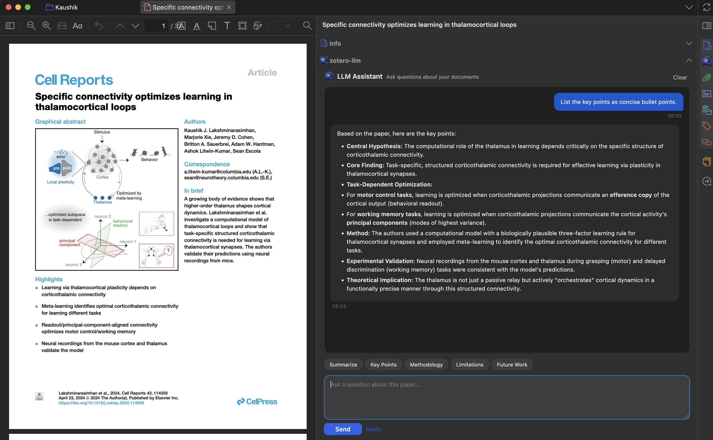

# Zotero-LLM: Your Right-Hand Side AI Research Assistant

## 🚀 Zotero-LLM v3.5.7 Release

Please see the latest [release notes](https://github.com/yilewang/zotero-llm/releases) for details. The UI has been redesigned (again😂) to be more intuitive and elegant. Optimized the codebase.

## 🗓️ Zotero-LLM v3.0 Release

This plugin now supports mainstream reasoning models, including `gpt-5.x` series from OpenAI, `gemini-3-pro-preview`, `gemini-2.5-flash` from Google, `deepseek-chat` and `deepseek-reasoner` from Deepseek, and `kimi-k2.5` series from Moonshot. You can easily connect to these models with your own API key and freely choose the reasoning level that fits your needs.

UI has been redesigned to be more intuitive and elegant. You can also customize the quick-action presets to fit your specific research needs.

## Introduction

**Zotero-LLM** is a powerful plugin for [Zotero](https://www.zotero.org/) that integrates Large Language Models (LLMs) directly into the Zotero PDF reader. Unlike other tools that require you to upload your pdfs to a portal, this plugin is designed to conveniently access LLMs without the need to leave Zotero. It quietly sits in the panel of the Zotero reader, like your standby research assistant, ready to help you with any questions you have when reading a paper.

<!--  -->

## Key Features

### 1. "Everything starts with: Summarize this paper for me"

It is always the first question that comes to mind when you open a new paper. With this plugin, you can get a concise summary of the paper in seconds, without having to read through the entire text. You can always find the relevant information you need, and quickly decide whether this paper is worth your time. The summary is generated based on the full content of the paper currently open in your Zotero reader, so you can be sure that the information is accurate and relevant. You can also customize the summary prompt to fit your specific research needs, such as focusing on the methodology, results, or implications of the paper.

### 2. "Explain this selected text for me"

If you come across a complex paragraph or a technical term that you don't understand, simply select the text and ask the model to explain it. 

In the plugin, you can enable the pop-up option to conveniently add text to the chat. 

**If you don't like it, that's totally fine. You can always disable it in the settings! I really think it is important to give you the choice.**

When you start your chat with the model, the full context of this paper is already loaded into the model, so the selected text is an additional layer of context that helps the model to provide a more accurate and detailed explanation. This feature is especially useful when you are reading a paper outside of your expertise, or when you want to quickly grasp the key points without getting lost in the details.

### 3. "What does this figure mean?"

In our research, understanding the figures equivalent to understanding the paper. With this plugin, you can take a screenshot of any figure in the paper and ask the model to interpret it for you. It will support up to 5 screenshots at a time.

### 4. "This answer is nice, I want to save it into my note"

This plugin supports seamless integration with your note-taking workflow. You can easily save an answer, or selected text generated by the model into your Zotero notes with just one click.

### 5. "I learned a lot from talking to you, I wish I could come back to it later"

The local conversation history is automatically saved and associated with the paper you are reading. You can also export the whole conversation into your note with markdown format. I spent a plenty amount effort to make sure the mathematical equations rendering is correct in the exported markdown, so complex knowledge will be presented in the most clear way in your note.

**The export to note function also supports saving the selected text and screenshots into your note with markdown format. So, you never lose context.**

### 6. "Do you remember my preference?"

You can customize the quick-action presets to fit your specific research workflow.

### 7. "Time to upgrade you, solider"

You can set up to 4 LLM models to help you handle different types of tasks: For instance,

- the multimodal model for helping you to interpret the Figure;
- text-based model for helping you understand text.

Different models can also be used for the same task, and you can cross check their answers to get a more comprehensive understanding of the paper.

If you want more customization, you can also set up different reasoning levels for the same model in the conversation panel, such as "default", "medium", "high" and "xhigh" for `gpt-5.2` series, "low" and "high" for `gemini-3-pro-preview`, "medium" for `gemini-2.5-flash`. You can always check the connections by clicking the "Test Connection" button in the settings.

If you are a pro player, you can also change some hyperparameters of the model, such as temperature, max_tokens_output, etc. to get more creative or more deterministic answers.

### 8. "Can you upgrade yourself?"

The plugin will automatically check for updates when you open Zotero. If I release an update, you will be able to update the plugin with just one click, without having to go through the installation process again. This way, you can always enjoy the latest features and improvements without any hassle.

### Installation

#### Step 1: Download the latest `.xpi` release

Download the latest `.xpi` release from the [Releases Page](https://github.com/yilewang/zotero-llm/releases).

Open `Zotero` and go to `Tools -> Add-ons`.

#### Step 2: Install the `.xpi` file

Click the gear icon and select `Install Add-on From File`

#### Step 3: Restart `Zotero`

Select the `.xpi` file and restart `Zotero` to complete the installation.

### Configuration

Open `Preferences` and navigate to the `Zotero-LLM` tab.

Select your Provider (e.g., OpenAI, Gemini, Deepseek).

Paste your API Base URL, secret key and model name.

I will give some popular model as example:

| API url                                                                   | Model Name           | Reasoning Level              |
| ------------------------------------------------------------------------- | -------------------- | ---------------------------- |
| https://api.openai.com/v1/chat/completions                                | gpt-5.2              | default, medium, high, xhigh |
| https://api.openai.com/v1/responses                                       | gpt-5.2              | default, medium, high, xhigh |
| https://api.deepseek.com/v1/chat/completions                              | deepseek-chat        | default                      |
| https://api.deepseek.com/v1/chat/completions                              | deepseek-reasoner    | default                      |
| https://generativelanguage.googleapis.com/v1beta/openai/chat/completions | gemini-3-pro-preview | low, high                    |
| https://generativelanguage.googleapis.com/v1beta/openai/chat/completions | gemini-2.5-flash     | medium                       |
| https://api.moonshot.ai/v1                               | kimi-k2.5            | default                      |

You can always check the connections by clicking the "Test Connection" button.

### Usage Guide

To chat with a paper, open any PDF in the Zotero reader.

Open the LLM Assistant sidebar (click the distinct icon in the right-hand toolbar).

Type a question in the chat box, such as "What is the main conclusion of this paper?"

### FAQ

> Q: Is it free to use?

A: Yes, absolutely free. You only pay for API calls, if you choose to use a paid API provider. If you think this tool is helpful, please consider supporting me with a star on GitHub or [buy me a coffee](https://buymeacoffee.com/yat.lok) .

> Q: Does this work with local models?

A: Actually, yes. As long as the local model provides an OpenAI compatible HTTP API that is compatible with the plugin, you can connect it by entering the appropriate API Base URL and secret key in the settings.

> Q: Is my data used to train models?

A: No. Since you use your own API key, your data privacy is governed by the terms of the API provider you choose (e.g., OpenAI Enterprise terms usually exclude training on API data).

> Q: If I have any questions, how to contact you?

A: Please feel free to open an issue on GitHub! I will try my best to help you.
